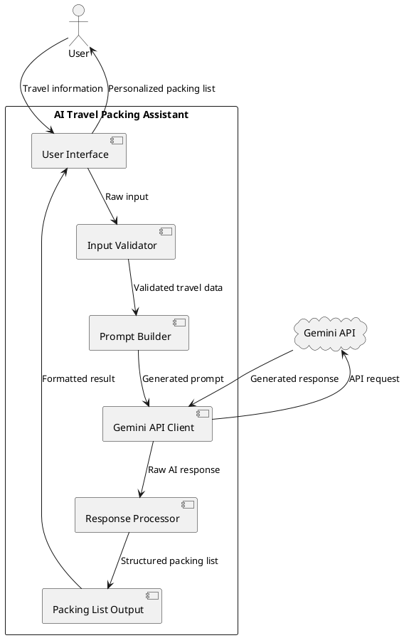
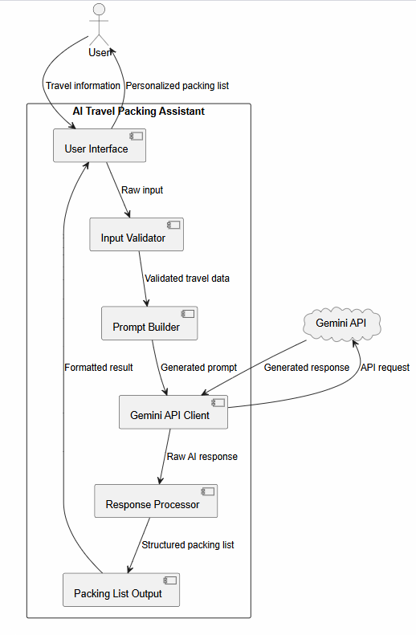
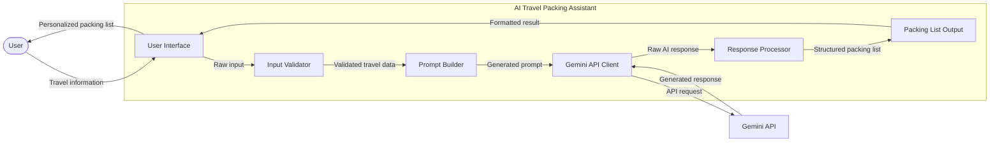
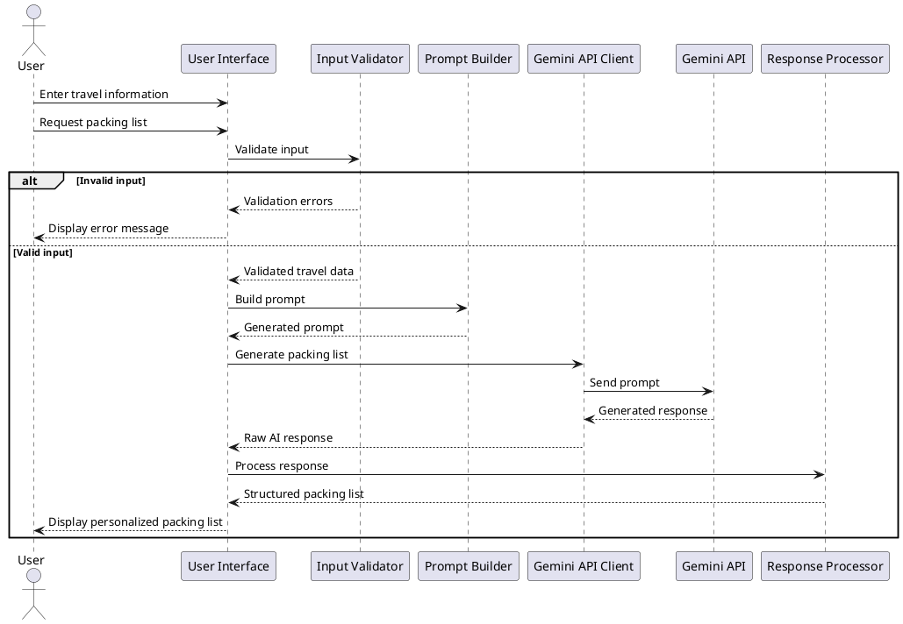
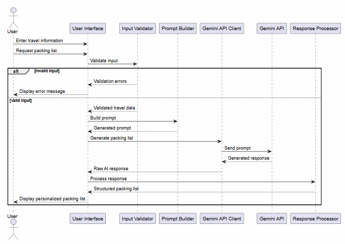
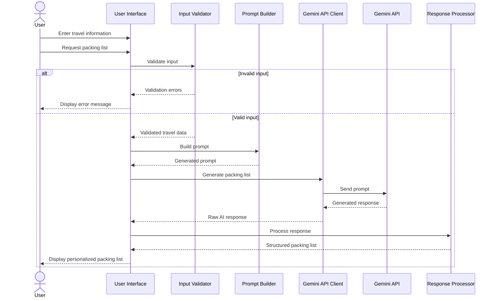

# AI Travel Packing Assistant

AI Travel Packing Assistant is an information system that uses generative AI to create a personalized travel packing list based on user-provided trip information.

The user provides information such as destination, trip duration, season, trip type, planned activities, luggage type, and additional preferences. The system validates the input, builds a prompt, sends it to the Gemini API, processes the generated response, and returns a structured packing list.

## UMLs

### PlantUML Component diagram

---

### Mermaid UML

### PlantUML Sequence diagram

---

### Mermaid UML

